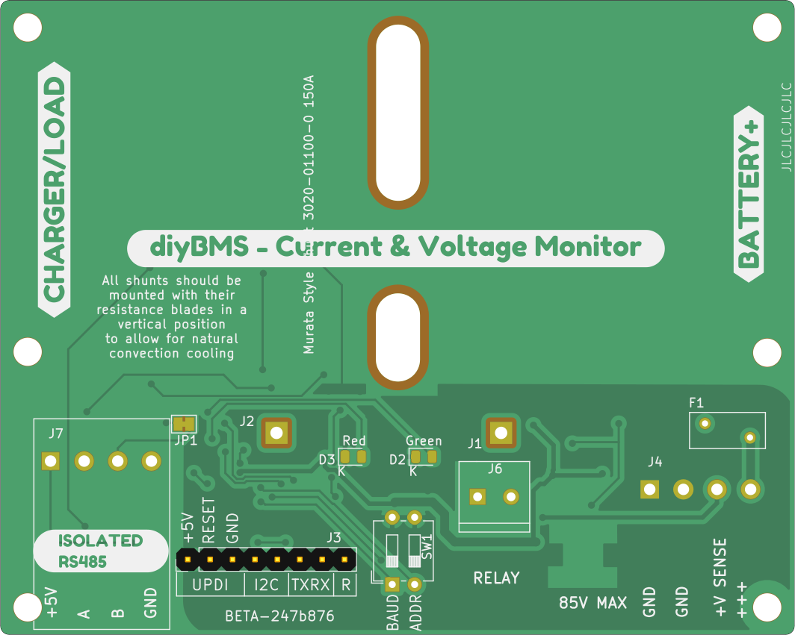
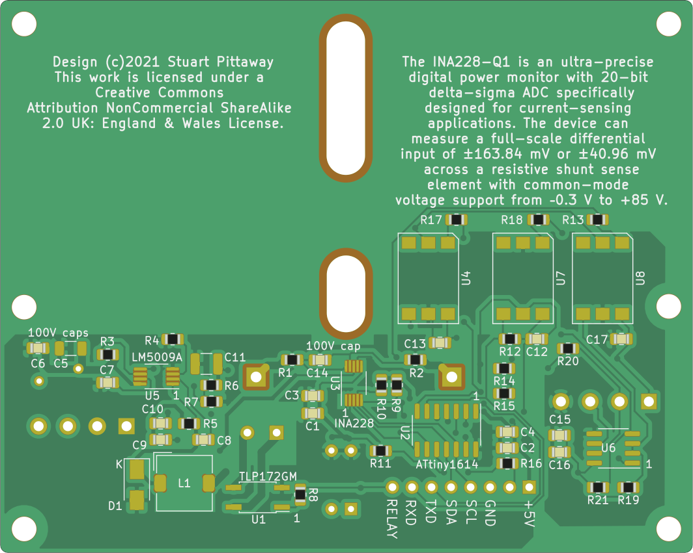

# diyBMS Current Monitor

Isolated current, voltage and amp hour counting monitor for battery banks up to 85 volt.

Designed for use with the diyBMS controller, although can be operated standalone using RS485 and MODBUS

The MODBUS register list is [here](./Code/diybmsCurrentShunt/MODBUS%20Registers.md)

# Videos on how to use and build

[YouTube playlist](https://youtube.com/playlist?list=PLHhwQCDPuRcZW3u0jJucsiCCsUbNbMy-c) for DIYBMS videos


# Support

If you find the BMS useful, please consider buying me a beer, check out Patron for more information

https://patreon.com/StuartP

Forum:
https://community.openenergymonitor.org/c/hardware/diybms/53


# HARDWARE

This repository contains the hardware designs, generally in KiCad format.  Unless you are changing the design, you don't need to use/install KiCad, just use the premade files.

The GERBER files are in the [export folder](CurrentShuntCircuit/export), along with the files for JLCPCB assembly service.  You need to request the BOTTOM of the board to be assembled!!

* [current_monitor_gerbers.zip](../../raw/master/CurrentShuntCircuit/export/current_monitor_gerbers.zip)
* [CurrentShuntCircuit_bom_jlc.csv](../../raw/master/CurrentShuntCircuit/export/CurrentShuntCircuit_bom_jlc.csv)
* [CurrentShuntCircuit_cpl_jlc.csv](../../raw/master/CurrentShuntCircuit/export/CurrentShuntCircuit_cpl_jlc.csv)

If you use this coupon code when you place a JLCPCB order

JLC-Stuart

and this link

https://jlcpcb.com/RSZ

you will get a discount and I get a very small amount of credit for every 30 orders, which helps to support the cost of prototyping new designs and adding new features.

Gerber and BOM files are automatically generated when changes are made to the design and pushed into GITHUB.

The bill of materials (BOM) is [here](./CurrentShuntCircuit/export/CurrentShuntCircuit-bom.csv)






## Texas Instruments

### INA228 (current sensor)
https://www.ti.com/product/INA228

### LM5009A (voltage regulator)
https://www.ti.com/product/LM5009A


## diyBMS Controller Changes

You need to add a "blob" of solder across solder bridge JP4 on the DIYBMS controller to enable RS485 termination resistor.


# SHUNT

The design is based on 50mV shunts, such as the Murata range

* 3020-01100-0 [150A](https://uk.farnell.com/murata-power-solutions/3020-01100-0/dc-shunt-150a-0-05v-screw/dp/2932602)
* 3020-0110X-0 [200A](https://uk.rs-online.com/web/p/shunts/8103277/) or [500A](https://uk.rs-online.com/web/p/shunts/8233570/)

technically, any 50mV shunt can be used, but the PCB is drilled specifically for the footprints of these devices.

Larger rating shunts will work, but won't fit onto the PCB

## PICKING THE CORRECT SHUNT 

Always pick a shunt at least 25% higher rating than you expect your maximum current load to be.

The INA chip uses 40.96mV maximum shunt voltage, so 50mV shunts are ideal for this range.

The maximum shunt current reading is calculated by this formula:

"Total shunt amp rating" * (40.96 / "Shunt mV scale")

For example a 200amp/50mV shunt:

200 * (40.96 / 50) = 163.84amp maximum reading.


# CODE/FIRMWARE

[](https://github.com/stuartpittaway/diyBMS-CurrentShunt/actions/workflows/build-code.yaml)

The board uses an ATTINY1614 chip, this requires an UPDI style of programmer, you can use an old Arduino style board to do this.  Take a look at [this](https://create.arduino.cc/projecthub/john-bradnam/create-your-own-updi-programmer-1e55f1).

Source code is located in the [Code](Code) folder, and requires PLATFORM.IO to compile.

Precompiled versions are available in the [releases](https://github.com/stuartpittaway/diyBMS-CurrentShunt/releases) page.  You use AVRDUDE to program these to the ATTINY chip using an UPDI programmer.

## Programming ATTINY1614

Use the file diyBMSCurrentMonitor_ATtiny1614.hex from the releases section.  This is precompiled for you, so after this all you need to do is use AVRDUDE to program the device.

AVRDUDE can be downloaded from [here](http://savannah.nongnu.org/projects/avrdude)

Change "COM8" to match your environment.  

```
avrdude -v -p attiny1614 -C avrdude.conf -c jtag2updi -b 115200 -P "COM8" -U flash:w:diyBMSCurrentMonitor_ATtiny1614.hex:i
```

# WARNING

This is a DIY product/solution so don’t use this for safety critical systems or in any situation where there could be a risk to life.  

There is no warranty, it may not work as expected or at all.

The use of this project is done so entirely at your own risk.  It may involve electrical voltages which could kill - if in doubt, seek help.

The use of this project may not be compliant with local laws or regulations - if in doubt, seek help.


# License

This work is licensed under a Creative Commons Attribution-NonCommercial-ShareAlike 2.0 UK: England & Wales License.

https://creativecommons.org/licenses/by-nc-sa/2.0/uk/

You are free to:
* Share — copy and redistribute the material in any medium or format
* Adapt — remix, transform, and build upon the material
The licensor cannot revoke these freedoms as long as you follow the license terms.

Under the following terms:
* Attribution — You must give appropriate credit, provide a link to the license, and indicate if changes were made. You may do so in any reasonable manner, but not in any way that suggests the licensor endorses you or your use.
* Non-Commercial — You may not use the material for commercial purposes.
* ShareAlike — If you remix, transform, or build upon the material, you must distribute your contributions under the same license as the original.
* No additional restrictions — You may not apply legal terms or technological measures that legally restrict others from doing anything the license permits.


Notices:
You do not have to comply with the license for elements of the material in the public domain or where your use is permitted by an applicable exception or limitation.

No warranties are given. The license may not give you all of the permissions necessary for your intended use. For example, other rights such as publicity, privacy, or moral rights may limit how you use the material.
